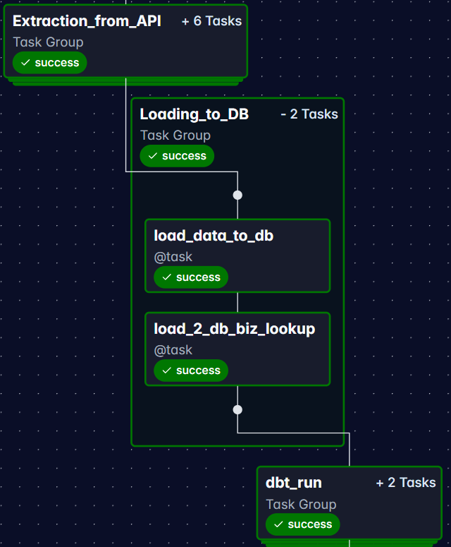

# Financial Market ELT Pipeline
[](https://github.com/syvixor/skills-icons)

Production-style data engineering project that ingests daily stock market and news sentiment data from Alpha Vantage, stores raw API responses in object storage, loads structured data into PostgreSQL, transforms it with dbt, and serves analytics-ready marts to dashboard applications.

This repository is the backend pipeline for the live dashboard project:

- Live Streamlit dashboard: [JINGHAOdata.engineer](https://www.jinghaodata.engineer/)
- Tableau Public dashboard: [Tickers Analysis Dashboard](https://public.tableau.com/views/TickersAnalysisDashboard/Dashboard?:language=en-US&:sid=&:redirect=auth&:display_count=n&:origin=viz_share_link)
- Frontend repository: [de-project-2-Streamlit-4-Viz](https://github.com/chenjinghao/de-project-2-Streamlit-4-Viz)

## What This Demonstrates

- Airflow orchestration with task groups, branching, pools, retries, and Slack notifications.
- Rate-limit-aware API ingestion that avoids duplicate extraction and supports partial reruns.
- Raw-to-mart ELT architecture using MinIO, PostgreSQL, and dbt Core.
- dbt modeling across staging, intermediate, and mart layers with uniqueness, null, accepted-value, and source freshness checks.
- Secure configuration through Airflow connections, environment variables, and GitHub Actions secrets.
- Docker/Astro local development plus deployment automation to a Google Cloud VM.
- Dashboard-ready analytical marts for stock price, volume, business metadata, and news sentiment analysis.

## Architecture


The pipeline follows a simple production-oriented pattern:

1. Airflow runs on a weekday schedule after market close.
2. A market-calendar check skips holidays.
3. Alpha Vantage API responses are written as raw JSON to MinIO.
4. Airflow loads raw objects into PostgreSQL.
5. dbt transforms raw JSON into staging, intermediate, and mart models.
6. Dashboard apps consume mart tables for visualization.
7. Slack notifications report pipeline success or failure.

## Data Pipeline Highlights

### Orchestration and Ingestion

The main DAG is defined in [`dags/most_active.py`](dags/most_active.py). It runs Monday to Friday, limits active runs/tasks, and uses an Airflow pool to respect Alpha Vantage API limits.

Key implementation details:

- `check_holiday` skips processing on NYSE holidays.
- `check_existing_files` inspects the current date folder in object storage and resumes from the first missing extraction step.
- Extraction tasks write raw JSON for most-active stocks, daily prices, news sentiment, and company overview data.
- Load tasks upsert raw payloads and business lookup data into PostgreSQL.
- Astronomer Cosmos runs the dbt project inside the Airflow workflow.

<details>
<summary>Airflow task flow screenshots</summary>

#### Extraction task group


#### Load-to-database task group



#### dbt task group


#### Full DAG


</details>

<details>
<summary>Slack notification screenshot</summary>


</details>

### Storage and Loading

The project uses a hybrid storage strategy:

- MinIO acts as an S3-compatible raw data lake for replayable API responses.
- PostgreSQL stores raw JSON payloads and transformed analytical tables.
- Raw loads use upsert behavior so reruns can repair missing or incomplete data for the same processing date.

### Transformation and Data Quality

The dbt project is located in [`include/dbt/my_project`](include/dbt/my_project). Models are organized into:

- `staging`: extracts normalized fields from raw JSON.
- `intermediate`: calculates reusable stock and sentiment metrics.
- `mart`: builds dashboard-facing tables.

The mart layer includes:

- `mart_price_news__analysis`: combines most-active stock metrics, 100-day price/volume statistics, and news sentiment counts.
- `mart_price_vol_chgn`: calculates daily price change and volume movement.
- `mart_news__recent`: exposes recent ticker-related news.

Data quality checks include:

- `not_null` tests for required dates, symbols, volumes, and metric fields.
- `unique` tests for composite business keys.
- `accepted_values` tests for rank and sentiment labels.
- dbt source freshness checks for raw market data.

## Dashboard Output

The backend powers a Streamlit dashboard and a Tableau Public version.

<details>
<summary>Dashboard screenshots</summary>

#### Expanded dashboard sections


#### Collapsed dashboard sections


</details>

Tableau Public cannot connect directly to the private PostgreSQL database in this setup, so the Tableau version uses a scheduled Google Apps Script bridge to sync selected mart tables into Google Sheets before Tableau refreshes. More detail is available in [`docs/tableau-public-sync.md`](docs/tableau-public-sync.md).

## Tech Stack

| Area | Tools |
| --- | --- |
| Orchestration | Apache Airflow, Astronomer Cosmos |
| Transformation | dbt Core, SQL |
| Language | Python |
| Storage | MinIO, PostgreSQL |
| Local runtime | Docker, Astro CLI |
| Cloud/Deployment | Google Cloud VM, GitHub Actions |
| Monitoring | Slack notifications, Airflow logs |
| Visualization | Streamlit, Tableau Public |

## Repository Structure

```text
de-project-1-airflow-dbt-4-ELT/
├── dags/
│   └── most_active.py                 # Main Airflow DAG
├── include/
│   ├── connection/                    # MinIO/GCS connection helpers
│   ├── dbt/my_project/                # dbt transformation project
│   │   ├── models/source/             # dbt sources
│   │   ├── models/staging/            # normalized source models
│   │   ├── models/intermediate/       # reusable metric models
│   │   └── models/mart/               # dashboard-facing marts
│   └── tasks/                         # Airflow task implementations
├── .github/workflows/
│   └── deploy_to_vm.yml               # VM deployment workflow
├── docs/                              # Supporting implementation notes
├── static/                            # Architecture and dashboard images
├── airflow_settings.yaml              # Local Airflow connections and pools
├── docker-compose.override.yml        # Local services
├── Dockerfile
├── requirements.txt
└── README.md
```

## Local Setup

### Prerequisites

- Docker Desktop
- Astro CLI
- Alpha Vantage API key
- Slack token, optional if you disable Slack notifications

### 1. Clone the repository

```bash
git clone https://github.com/chenjinghao/de-project-1-airflow-dbt-4-ELT.git
cd de-project-1-airflow-dbt-4-ELT
```

### 2. Configure environment variables

Copy the sample environment file and fill in your credentials:

```bash
cp .env.example .env
```

Required variables:

```bash
POSTGRES_USER=postgres
POSTGRES_PASSWORD=postgres
POSTGRES_DB=stocks_db
POSTGRES_PORT=5000

MINIO_ROOT_USER=minioadmin
MINIO_ROOT_PASSWORD=minioadmin

ALPHA_VANTAGE_API_KEY=your_api_key
SLACK_API_TOKEN=your_slack_token
```

The `.env` file is intentionally ignored by Git. These variables are consumed by `docker-compose.override.yml` and `airflow_settings.yaml`.

You can inspect the resolved Docker Compose configuration with:

```bash
docker compose -f docker-compose.override.yml config
```

### 3. Start Airflow locally

```bash
astro dev start
```

Local service URLs:

- Airflow UI: [http://localhost:8080](http://localhost:8080)
- MinIO Console: [http://localhost:19001](http://localhost:19001)
- pgAdmin: [http://localhost:5800](http://localhost:5800)

Astro imports `airflow_settings.yaml` on startup. If you need to reload connections and pools manually, run:

```bash
astro dev object import
```

### 4. Validate dbt models

After the services are running and data has been loaded, run dbt checks from the dbt project directory:

```bash
cd include/dbt/my_project
dbt build --profiles-dir ..
dbt source freshness --profiles-dir ..
```

## Deployment

The GitHub Actions workflow in [`.github/workflows/deploy_to_vm.yml`](.github/workflows/deploy_to_vm.yml) deploys updates to a Google Cloud VM.

Deployment highlights:

- GitHub Actions authenticates to GCP with a service account secret.
- Runtime `.env` and `airflow_settings.yaml` files are generated from GitHub secrets.
- The VM pulls the latest `main` branch and runs the Airflow project.
- Secrets stay outside the repository.

Required GitHub secrets include:

- `GCP_SA_KEY_VM_ELT`
- `SSH_USERNAME`
- `INSTANCE_NAME`
- `ZONE`
- `POSTGRES_USER`
- `POSTGRES_PASSWORD`
- `POSTGRES_DB`
- `POSTGRES_PORT`
- `MINIO_ROOT_USER`
- `MINIO_ROOT_PASSWORD`
- `ALPHA_VANTAGE_API_KEY`
- `SLACK_API_TOKEN`

## Troubleshooting

If PostgreSQL startup fails because port `5432` is already in use, either stop the conflicting local service or change the mapped port in your environment/compose configuration.

On Windows, you can identify the process with:

```powershell
netstat -ano | findstr :5432
```

Then stop the process if it is safe to do so:

```powershell
taskkill /pid <PID> /f
```

## Design Tradeoffs and Future Improvements

- I used dbt tests instead of a separate data-quality service to keep the VM lightweight and cost-effective for this data volume.
- MinIO is used locally and on the VM as an S3-compatible object store; the connection layer includes comments for switching to Google Cloud Storage.
- A natural next step would be to add Great Expectations or Soda checks if the pipeline expands to more data sources or stricter data contracts.
- Additional CI checks could run dbt parsing, SQL linting, and Python unit tests before deployment.

## References

Courses and learning resources:

- [Learn Apache Airflow from Astronomer Academy](https://academy.astronomer.io)
- [Apache Airflow: The Hands-On Guide](https://www.udemy.com/course/the-ultimate-hands-on-course-to-master-apache-airflow/)
- [dbt Certified Developer Path](https://learn.getdbt.com/learn/learning-path/dbt-certified-developer)
- [Data Engineering Zoomcamp](https://datatalks.club/blog/data-engineering-zoomcamp.html)

Documentation:

- [Astronomer Documentation](https://www.astronomer.io/docs)
- [dbt Documentation](https://docs.getdbt.com/docs/build/documentation)
- [Alpha Vantage API](https://www.alphavantage.co)
- [Slack API](https://api.slack.com)
- [MinIO Documentation](https://min.io/docs)
- [PostgreSQL Documentation](https://www.postgresql.org/docs/)
- [Docker Documentation](https://docs.docker.com)

## Connect With Me

- Portfolio: [https://adamchenjinghao.notion.site](https://adamchenjinghao.notion.site)
- Email: [Adam_CJH@outlook.com](mailto:Adam_CJH@outlook.com)
- LinkedIn: [linkedin.com/in/adam-cjh](https://www.linkedin.com/in/adam-cjh)
